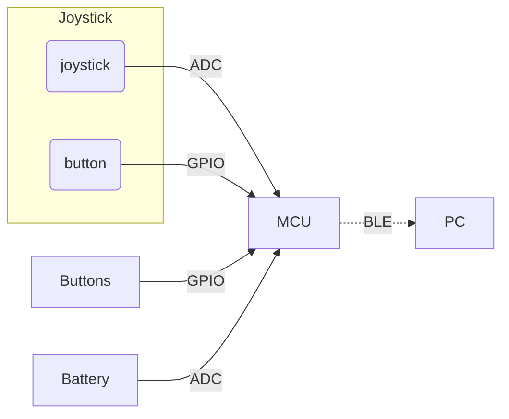

# ble_joystick (Firmware)

SDK : [nRF5_SDK_15.2.0_9412b96](https://www.nordicsemi.com/-/media/Software-and-other-downloads/SDKs/nRF5/Binaries/nRF5SDK15209412b96.zip)

project : nRF5_SDK_15.2.0_9412b96\examples\ble_peripheral\ble_joystick

copy from : nRF5_SDK_15.2.0_9412b96\examples\ble_peripheral\ble_app_hids_mouse

## Block diagram

